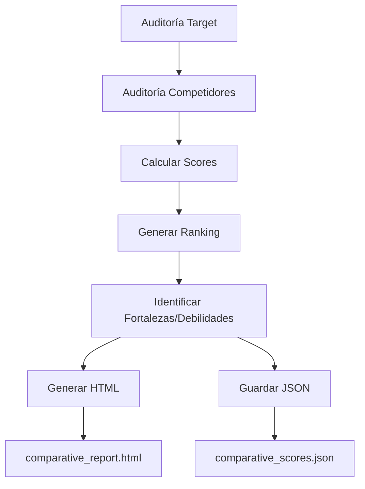

# 📊 Análisis Comparativo Automático

## ✅ Integración Completa

El análisis comparativo ahora se ejecuta **automáticamente** en cada auditoría del pipeline.

## 🚀 Características

### 1. **Cálculo Automático de Puntajes**
Cada auditoría (target + competidores) recibe puntajes en 4 categorías:

- **Estructura** (0-100): H1, jerarquía, HTML semántico
- **Contenido** (0-100): Claridad, tono conversacional, FAQs
- **E-E-A-T** (0-100): Autor, fechas, transparencia, enlaces
- **Schema** (0-100): Presencia y tipos de Schema.org
- **Total** (0-100): Promedio de las 4 categorías

### 2. **Ranking Automático**
Los sitios se ordenan por puntaje total, mostrando la posición competitiva.

### 3. **Fortalezas y Debilidades**
Identificación automática:
- **Fortalezas**: Puntajes ≥ 70
- **Debilidades**: Puntajes < 50

### 4. **Reportes Generados**

#### `comparative_report.html`
- Visualización interactiva con gráficos
- Tablas comparativas
- Análisis de fortalezas/debilidades

#### `comparative_scores.json`
- Datos estructurados para integración
- Puntajes detallados
- Ranking y análisis

## 📁 Ubicación de Archivos

```
auditor/
├── backend/
│   └── app/
│       └── services/
│           ├── pipeline_service.py          # Pipeline con análisis integrado
│           └── comparative_report_generator.py  # Generador de HTML
├── comparative_analysis.py                  # Script standalone
└── reports/
    ├── comparative_report.html              # Reporte visual
    └── comparative_scores.json              # Datos JSON
```

## 🔧 Uso

### Automático (Integrado en Pipeline)

```python
from app.services.pipeline_service import PipelineService

result = await PipelineService.run_complete_audit(
    url="https://example.com",
    # ... otros parámetros
)

# El resultado incluye:
# result['comparative_analysis'] = {
#     'scores': [...],
#     'ranking': [...],
#     'analysis': [...],
#     'summary': {...}
# }
```

### Manual (Script Standalone)

```bash
python comparative_analysis.py "path/to/final_llm_context.json"
```

## 📊 Ejemplo de Salida

### Consola
```
====================================================================================================
RANKING GENERAL
====================================================================================================
1. https://zencoder.ai/es/blog/best-ai-for-coding - 58.9/100
2. https://www.skillnest.com/blog/... - 50.3/100
3. https://cloud.google.com/use-cases/... - 42.9/100
4. SITE-WIDE AGGREGATE: https://www.codegpt.co/ - 37.0/100
====================================================================================================
```

### JSON
```json
{
  "scores": [
    {
      "url": "https://www.codegpt.co/",
      "scores": {
        "structure": 76.7,
        "content": 71.5,
        "eeat": 0.0,
        "schema": 0,
        "total": 37.0
      }
    }
  ],
  "summary": {
    "target_position": 4,
    "total_competitors": 3,
    "target_score": 37.0,
    "best_competitor_score": 58.9
  }
}
```

## 🎯 Algoritmo de Scoring

### Estructura (0-100)
```python
score = 0
score += 25 if h1_check == 'pass' else 0
score += 25 if no_hierarchy_issues else 0
score += semantic_html_percent * 0.5
```

### Contenido (0-100)
```python
score = 0
score += max(0, 100 - long_paragraphs * 5)
score += conversational_tone * 10
score += 25 if has_faqs else 0
score += 25 if inverted_pyramid else 0
score = score / 2
```

### E-E-A-T (0-100)
```python
score = 0
score += 25 if has_author else 0
score += min(25, external_links * 0.5)
score += 25 if has_dates else 0
score += 25 * (about + contact + privacy) / 3
```

### Schema (0-100)
```python
score = 0
score += 50 if schema_present else 0
score += min(50, schema_types_count * 25)
```

## 🔄 Flujo de Ejecución



## 📈 Beneficios

1. **Automatización**: Sin intervención manual
2. **Consistencia**: Mismo algoritmo para todos
3. **Visualización**: Gráficos interactivos
4. **Accionable**: Identifica prioridades claras
5. **Integrable**: JSON para dashboards/APIs

## 🛠️ Personalización

### Ajustar Pesos de Scoring

Edita `pipeline_service.py`:

```python
@staticmethod
def calculate_scores(audit_data: Dict[str, Any]) -> Dict[str, float]:
    # Modificar pesos aquí
    structure_score += 30 if h1_pass else 0  # Cambiar de 25 a 30
    # ...
```

### Agregar Nuevas Métricas

```python
# En calculate_scores()
scores['performance'] = calculate_performance_score(audit_data)
scores['total'] = sum(scores.values()) / len(scores)
```

## 🐛 Troubleshooting

### Error: "No comparative_analysis in result"
- Verifica que `competitor_audits` no esté vacío
- Revisa logs para errores en `generate_comparative_analysis`

### Reportes no se generan
- Verifica permisos de escritura en `reports/`
- Revisa que `comparative_report_generator.py` esté importable

### Puntajes inesperados
- Revisa datos de entrada en `target_audit`
- Verifica que campos requeridos existan

## 📝 Notas

- Los reportes se sobrescriben en cada ejecución
- Para múltiples auditorías, renombra archivos manualmente
- El análisis requiere al menos 1 competidor para comparación

## 🚀 Próximas Mejoras

- [ ] Guardar histórico de comparaciones
- [ ] Gráficos de tendencias temporales
- [ ] Exportar a PDF
- [ ] Dashboard interactivo
- [ ] Alertas de cambios significativos
